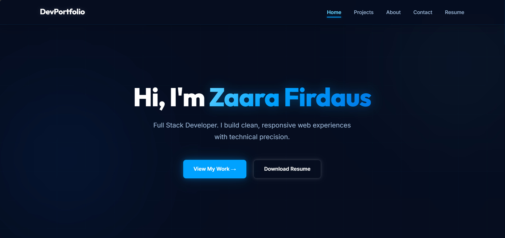
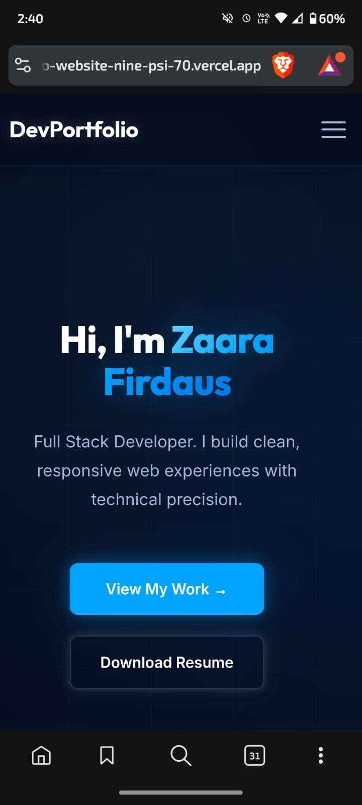
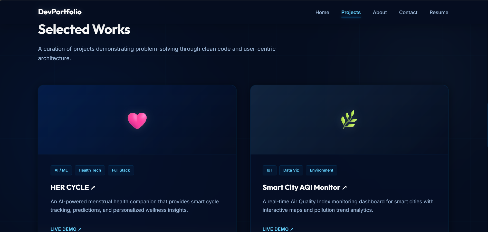
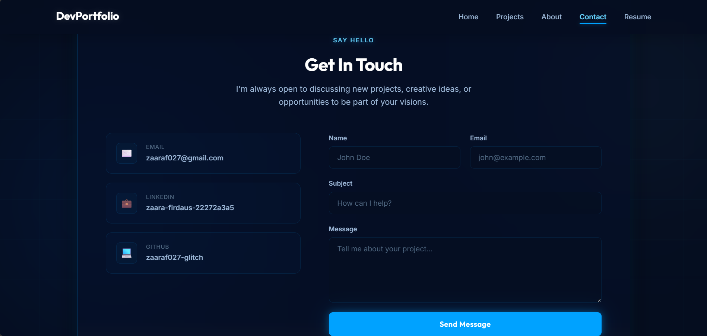

# 🌐 Task 1 — Personal Portfolio Website

> A multi-page, responsive personal portfolio website built with HTML, CSS, and JavaScript.

---

## 📋 Overview

This portfolio website showcases my skills, projects, and contact information in a clean, modern, and recruiter-friendly design. It is built entirely with vanilla HTML, CSS, and JavaScript — no frameworks or libraries.

---

## 📄 Pages

| Page | File | Description |
|------|------|-------------|
| **Home** | `index.html` | Hero section with introduction and call-to-action |
| **About** | `about.html` | Bio, education, and skills overview |
| **Projects** | `projects.html` | Showcase of completed projects with links |
| **Contact** | `contact.html` | Contact form and social media links |

---

## 📂 File Structure

```
portfolio-website/
├── index.html
├── about.html
├── projects.html
├── contact.html
├── css/
│   └── style.css
├── js/
│   └── script.js
├── assets/
│   ├── images/
│   └── icons/
├── screenshots/
│   ├── portfolio-home-desktop.png
│   ├── portfolio-home-mobile.png
│   ├── portfolio-projects.png
│   └── portfolio-contact.png
└── README.md
```

---

## ✨ Key Features

- ✅ Fully responsive design (desktop, tablet, mobile)
- ✅ Clean and semantic HTML5 structure
- ✅ Modern CSS3 styling with custom properties
- ✅ Smooth scroll navigation
- ✅ Interactive contact form with validation
- ✅ Accessible and SEO-friendly markup

---

## 📸 Screenshots

| View | Preview |
|------|---------|
##| Desktop Home |
 |
##| Mobile Home |
 |
##| Projects Page |
 |
##| Contact Page | 
 |

---

## 🚀 How to Run

```bash
cd portfolio-website
# Open index.html in your browser
```

---

## 🛠️ Technologies

- HTML5
- CSS3 (Flexbox, Grid)
- JavaScript (ES6+)

---

<p align="center">
  Built by <strong>Zaara Firdaus</strong> — WeIntern Week 1
</p>
